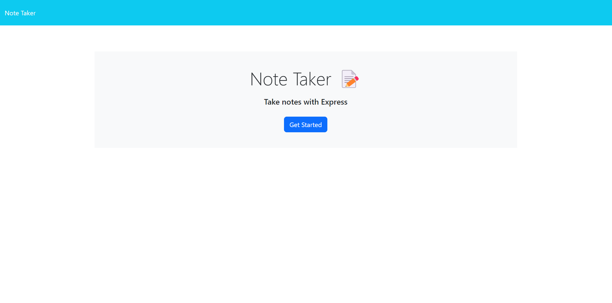
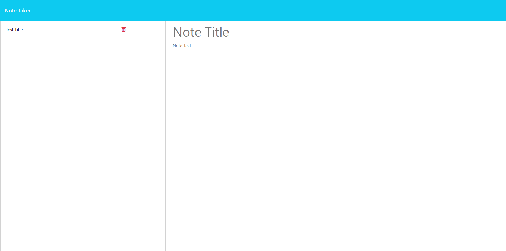

# Note Taker

Note Taker is a simple web application that allows users to write and save notes. The application uses an Express.js back end to handle data storage and retrieval from a JSON file. Users can organize their thoughts and keep track of tasks by creating, saving, and deleting notes.

## Table of Contents

- [Installation](#installation)
- [Usage](#usage)
- [Features](#features)
- [Contributing](#contributing)
- [License](#license)

## How to use
* Once you are on the page click on the "get started" button to be taken to the note taking page
* Once there, type in your note title and content
* Click in the top right on save note, to save the note
* Once you are done with the note, click delete(the trash can on the note) to get rid of the note!
* Clear form button in top right will clear the current note before saving it

## Features
* Create Notes: Enter a title and text for a new note.
* Save Notes: Click the "Save Note" button to save a new note.
* View Notes: Click on an existing note to view its details.
* Delete Notes: Click the delete button next to a note to remove it.
* Clear Form: Clear the note entry form by clicking the "Clear Form" button.

## Images of site

## Link to live site on Heroku
https://express-notes-takers-998af2a3d024.herokuapp.com

## License
This project is under the MIT License

## Contributors
Landon Peterson and heres a link to my github[https://github.com/LandonP172]
